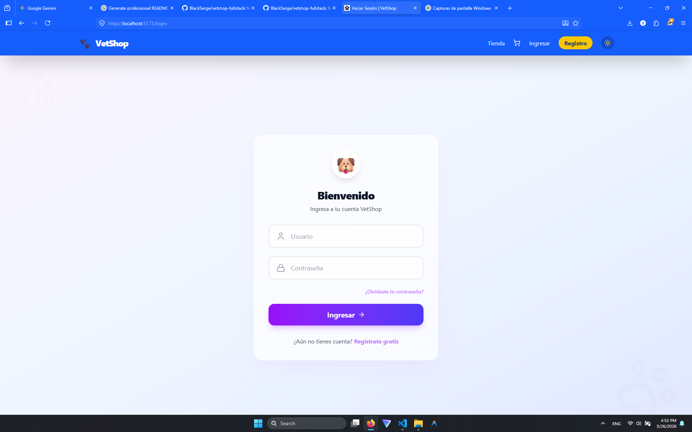

# 🐾 Tienda Veterinaria Full-Stack

Plataforma **e-commerce veterinaria integral** para centralizar catálogo, carrito, checkout y gestión administrativa en una sola solución moderna.

---

## ✨ Key Features

| Feature | Descripción |
|---|---|
| 🧴 **Gestión de productos** | Catálogo con categorías, filtros y búsqueda optimizada. |
| 🛒 **Carrito funcional** | Flujo completo de compra con actualización de cantidades y resumen de pedido. |
| 💳 **Pagos con Stripe** | Integración de pagos reales con soporte para webhooks y pruebas locales con Stripe CLI. |
| 🔐 **Autenticación segura** | Registro/login y control de acceso para usuarios y administradores. |
| 🛠️ **Panel de administración** | Gestión de productos, categorías, usuarios y operación comercial. |

---

## 🧰 Stack Tecnológico

### Backend
- **Python**
- **Django / Django REST Framework**
- **PostgreSQL** con migración cloud en **Neon / Render**

### Frontend
- **React / Vite**
- **Tailwind CSS**

### Herramientas
- **Docker**
- **GitHub Actions**
- **Stripe CLI**
- **Cloudinary**

### ☁️ Infraestructura de datos y media
- **Base de datos** en PostgreSQL cloud (**Neon/Render**).
- **Media e imágenes** gestionadas en **Cloudinary**.

---

## 🏗️ Arquitectura y Diseño

El proyecto sigue una organización **Feature-Based** y una **Service Layer** para separar lógica de negocio, acceso a datos y capa de entrega (API/UI).

Beneficios clave:
- Mejor mantenibilidad y escalabilidad.
- Menor acoplamiento entre módulos.
- Testing más claro por casos de uso.

---

## ⚡ Guía de Instalación Rápida

> Requisitos: **Python 3.11+**, **Node.js 20+**, **PostgreSQL**, **Git**.

### 1) Clonar repositorio

```bash
git clone https://github.com/BlackSerge/vetshop-fullstack.git
cd vetshop-fullstack
```

### 2) Backend (Django)

```bash
cd tienda-veterinaria-backend
python -m venv .venv
source .venv/bin/activate   # Windows: .venv\Scripts\activate
pip install -r requirements.txt
cp .env.example .env
python manage.py migrate
python manage.py runserver
```

### 3) Frontend

```bash
cd ../tienda-veterinaria-frontend
npm install
# o
yarn install
npm run dev
```

### 4) Variables de entorno

Usa **`.env.example`** como base de configuración para backend/frontend y completa credenciales de DB, Stripe, Cloudinary y autenticación.

### 5) Stripe local (webhooks + CLI)

```bash
stripe listen --forward-to localhost:8000/api/payments/webhook/
```

---

## 📚 Documentación de la API

Swagger/OpenAPI 3.0 está operativo en:
- **Schema JSON/YAML**: `/api/schema/`
- **Swagger UI**: `/api/docs/`

Con el contrato OpenAPI generado (`schema.yml`), el frontend **React/Vite** puede tipar clientes HTTP y reducir/eliminar usos de `any` en servicios y modelos.

Para regenerar el contrato OpenAPI en backend:

```bash
cd tienda-veterinaria-backend
python manage.py spectacular --file schema.yml
```

---

## 🖼️ Capturas de Pantalla

> Esta sección usa imágenes desde la carpeta `docs/` de tu proyecto local.

### 🔐 Login


### 🛍️ Tienda


### 💳 Checkout


---

## 📄 Licencia

Este proyecto está licenciado bajo **MIT**. Ver archivo `LICENSE`.
